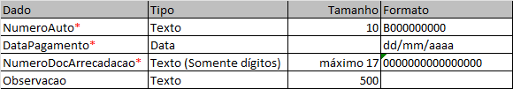

# Registro_pagamento
 
Execução de registros de pagamentos do SIOR

### **Necessidades**

Para rodar a ferramenta em sua máquina, é necessário possuir os seguintes requisitos:

- Vscode ou uma IDE com capacidade de versionamento;
- Python instalado na máquina;
- Necessário instalar as importações que irá solicitar na primeira execução (_Requirements.txt_);
- Ter acesso ao sistema SIOR.
- Ter Excel instalado na máquina

### **Funcionalidade**

Realizar o registro de pagamento de autos na situação cobrança, de maneira unitária.

### **Validações**

campos:
Autos
NumeroAuto*	Texto	10	B000000000
DataPagamento*	Data		dd/mm/aaaa
NumeroDocArrecadacao*	Texto (Somente dígitos)	máximo 17	0000000000000000
Observacao	Texto	500	

#### **IMPORTANTE**!
O Campo observação deverá conter apenas Números (Int)

Após a execução, o operador deverá: 
- Apagar da listagem os Devedores já distribuídos;